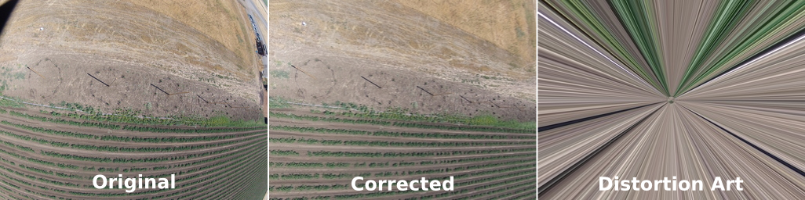

#Lens Correction 
#####(aka Zap-distortion)

A Python script to batch correct photo distortion for a GoPro Hero2 using the Lenfun database. 

Should be adaptable for any camera in the lensfun db.

##Requirements
* Python 2.7 (should work with Python 3 if you have OpenCV with Python 3 bindings)
* OpenCV 2.4.x (with Python bindings)
* Lensfun 2.8+ , lensfunpy
* piexif
* GoPro.xml lensfun definition in the lensfun path, it's too new to be in the packaged versions (I think it's in 3.0+)
    * Put it in ~/.local/share/lensfun/ or in /usr/share/lensfun (on a Linux system)

See pre.sh for more details.

Example

##Usage
1. Install the prequisites
```
#On Ubuntu
sudo apt-get install python-opencv lensfun0
sudo pip install lensfunpy
sudo pip install piexif
git clone https://github.com/wildintellect/lenscorrection.git
mkdir -p ~/.local/share/lensfun/
sudo cp lenscorrection/gopro.xml ~/.local/share/lensfun/
```
1. Open a terminal in the directory where you have photos.
1. Run the code
```
python /path/to/undistort.py
```
Results will be filename_fix.jpg

##Notes

* Currently only does GoPro Hero2
* Exif is copied from original image except for a few values.
    * Model is set to HD2 U , so you can tell it apart from an unmodified image
    * Focal Length in 35mm is estimated based on the lost amount of image from the original, as the correction crops the edges.
